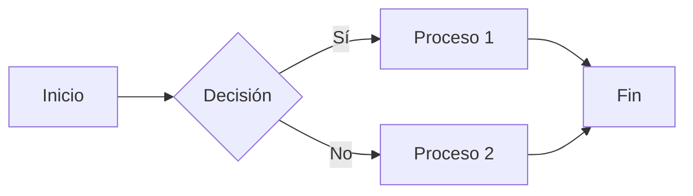

Esta publicación es para mostrar la renderización de la sintaxis de Markdown en [**Chirpy**](https://github.com/cotes2020/jekyll-theme-chirpy/fork), también puedes usarla como un ejemplo de escritura. Ahora, comencemos a ver el texto y la tipografía.

## Encabezados

# H1 - encabezado
{: .mt-4 .mb-0 }

## H2 - encabezado
{: data-toc-skip='' .mt-4 .mb-0 }

### H3 - encabezado
{: data-toc-skip='' .mt-4 .mb-0 }

#### H4 - encabezado
{: data-toc-skip='' .mt-4 }

## Párrafo

Quisque egestas convallis ipsum, ut sollicitudin risus tincidunt a. Maecenas interdum malesuada egestas. Duis consectetur porta risus, sit amet vulputate urna facilisis ac. Phasellus semper dui non purus ultrices sodales. Aliquam ante lorem, ornare a feugiat ac, finibus nec mauris. Vivamus ut tristique nisi. Sed vel leo vulputate, efficitur risus non, posuere mi. Nullam tincidunt bibendum rutrum. Proin commodo ornare sapien. Vivamus interdum diam sed sapien blandit, sit amet aliquam risus mattis. Nullam arcu turpis, mollis quis laoreet at, placerat id nibh. Suspendisse venenatis eros eros.

## Listas

### Lista ordenada

1. Primero
2. Segundo
3. Tercero

### Lista desordenada

- Capítulo
  + Sección
    * Párrafo

### Lista de tareas

- [ ] Trabajo
  + [x] Paso 1
  + [x] Paso 2
  + [ ] Paso 3

### Lista de descripción

Sol
: la estrella alrededor de la cual la tierra orbita

Luna
: el satélite natural de la tierra, visible por la luz reflejada del sol

## Cita en bloque

> Esta línea muestra la _cita en bloque_.

## Indicaciones

> Un ejemplo que muestra el tipo de indicación `consejo`.
{: .prompt-tip }

> Un ejemplo que muestra el tipo de indicación `información`.
{: .prompt-info }

> Un ejemplo que muestra el tipo de indicación `advertencia`.
{: .prompt-warning }

> Un ejemplo que muestra el tipo de indicación `peligro`.
{: .prompt-danger }

## Tablas

| Empresa                      | Contacto          | País   |
|:-----------------------------|:-----------------|-------:|
| Alfreds Futterkiste          | Maria Anders     | Alemania |
| Island Trading               | Helen Bennett    | Reino Unido |
| Magazzini Alimentari Riuniti | Giovanni Rovelli | Italia  |

## Enlaces

<http://127.0.0.1:4000>

## Nota al pie

Haz clic en el gancho para localizar la nota al pie[^1], y aquí hay otra nota al pie[^2].  <br>

[^1]: Aquí va el contenido de la primera nota al pie.

[^2]: Aquí va el contenido de la segunda nota al pie.

## Código en línea

Este es un ejemplo de `Código en Línea`.

## Ruta de archivo

Aquí está la `/ruta/al/archivo.extensión`{: .filepath}.

## Bloques de código

### Común

```
Este es un fragmento de código común, sin resaltado de sintaxis ni número de línea.
```

### Lenguaje Específico

```bash
if [ $? -ne 0 ]; then
  echo "El comando no fue exitoso.";
  #hacer lo necesario / salir
fi;
```

### Nombre de archivo específico

```sass
@import
  "colores/typografia-clara",
  "colores/typografia-oscura";
```
{: file='_sass/jekyll-theme-chirpy.scss'}

## Matemáticas

Las matemáticas potenciadas por [**MathJax**](https://www.mathjax.org/):

$$ \sum_{n=1}^\infty 1/n^2 = \frac{\pi^2}{6} $$

Cuando $a \ne 0$, hay dos soluciones para $ax^2 + bx + c = 0$ y son

$$ x = {-b \pm \sqrt{b^2-4ac} \over 2a} $$

## SVG Mermaid



## Imágenes

### Predeterminado (con subtítulo)

{: width="972" height="589" }
_Ancho completo de pantalla y alineación central_

### Alineado a la izquierda

{: width="972" height="589" .w-75 .normal}

### Flotar a la izquierda

{: width="972" height="589" .w-50 .left}
Praesent maximus aliquam sapien. Sed vel neque in dolor pulvinar auctor. Maecenas pharetra, sem sit amet inter


